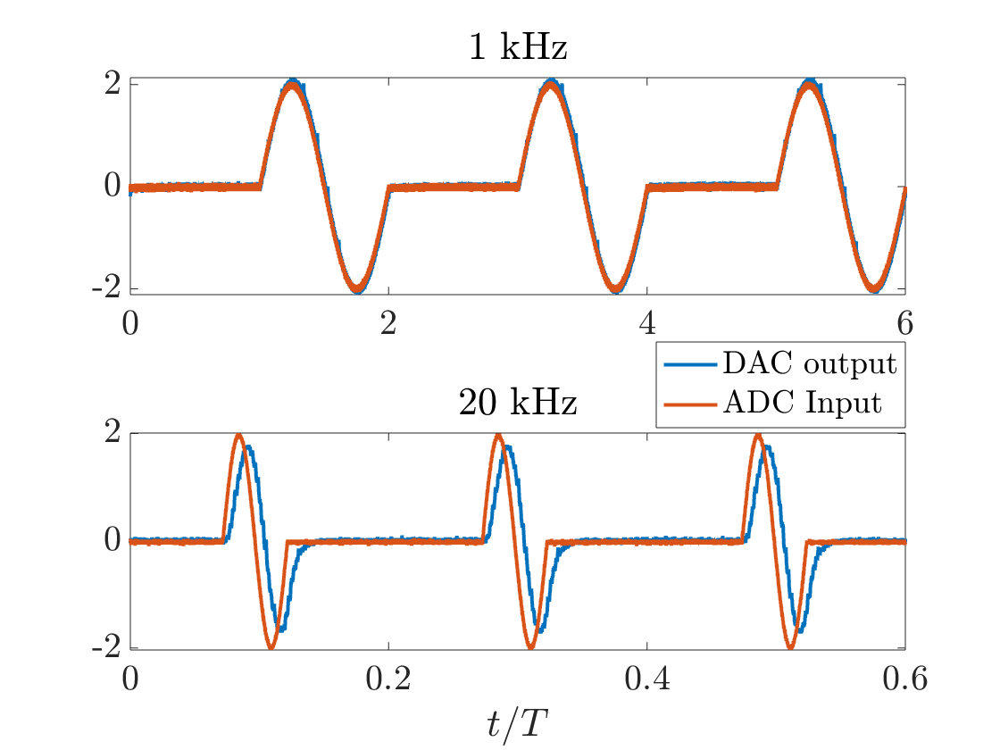

# Teensy-Controller
This project aims at building a cost effective toolbox for active acoustic control, whether it is to solve physical problems (noise control, active metamaterials..) or for audio applications. For this targeted applications, it is expected that the system obtains some physical analog inputs and output an analog treated version of the input.  

To ensure sufficient performances and minimal delay, we will use the Teensy 4.1 microcontroller and build all the necessary circuitery (level shift, analog conversion...) and codes. This work is split as follow:
* Analog output using the MCP4822 via the SPI interface.
* Simultenous reading (internal ADC) and writing (MCP4822)
* Conditionning of the analog input (1.65 DC offset and clamping)

# External DAC

   
  <em> Figure 1: Sketch of the circuit using the MCP4822. Each output of the DAC is connected to a different terminal. One output corresponds to the raw signal while the second is filtered (High pass RC filter).  </em>

Using the MCP4822 with a Teensy is relatively easy using the SPI interface. In fact, there is several online tutorials covering this topic (using arduino/ESP32..). The circuit used in this work is given in Figure 1. Both outputs are used, one  corresponds to the raw DAC output signal while the second is filtered using a simple low pass RC filter.

# Input-Output

   
  <em> Figure 2: Version 1 of the controller (corresponds to the schematic in Figure 1).  </em>

A first PCB (Figure 2)  was printed following the schematic in Figure 1. While not perfect, it is sufficient to ensure better connection between the components,improve stability, and cleaner look. The design will be improved at a later stage when this work have sufficiently advanced (e.g. better bypass, more pins for the teensy, reduces the traces length, include the offset and clamping circuit for the inputs, BNC terminals...). 
Additionally, I will use the analog input of the Teensy (pin A5 in most cases) at the begining. While better signal can be acquired using an external ADC, the native one is sufficient for most of my applications. I might do some tests in the future using the  MCP3208.

Since the analog pin can safely accept only voltages between 0 and 3.3 V, a DC offset is introduced using a non-inverting summing buffer (see Fig. 3). To implement this stage, I tested two operational amplifiers that I had on hand: the MCP602 and the TLC272. Both provide acceptable performance, with the TLC272 having the upper hand. However, neither amplifier features a rail-to-rail input stage. For the current tests, I decided to power the TLC272 with 0 to 5V and avoid providing large voltages. Later on, I'll either uses two Schotky diodes to clamp the voltage at 0 and 3.3V or find a better opamp.

   
  <em>Figure 3: </em>

   
  <em>Figure 4: Input (Frequency generator) vs Output (MCP4822 Output) for different frequencies. The excitation corresponds to a burst sine with one cycle. Total delay between the two signal is around 7-8us </em>

