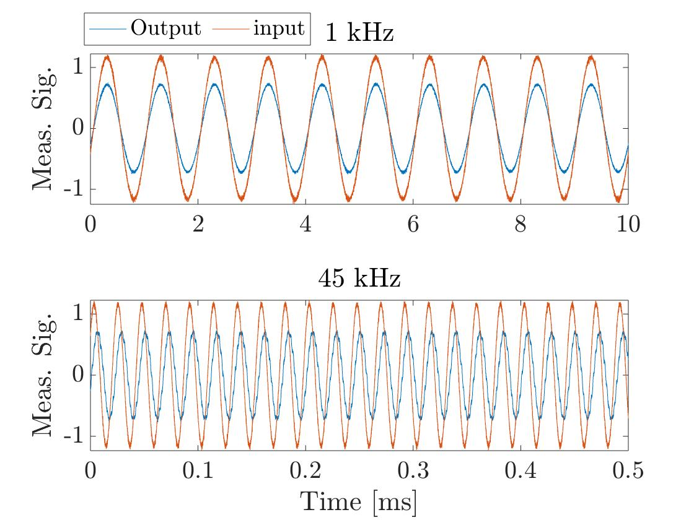
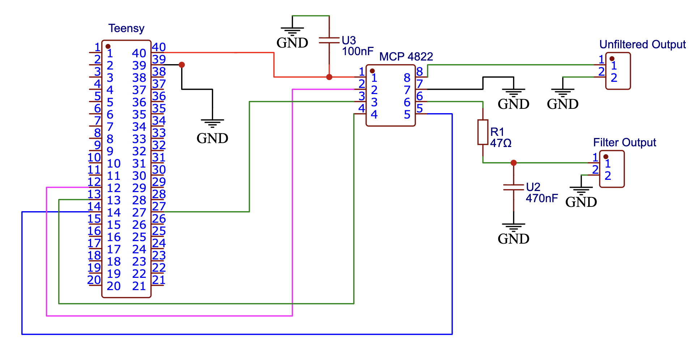

# Teensy-Controller
The goal is to build a fast controller for audio manipulation. For this, we will use the Teensy 4.1 and build all the necessary circuitery (conditionning, Analog conversion...) and codes.
* DAC using the MCP 4822 is done. More details in the corresponding file.
* External ADC, in progress.

Note: Work in Progress

First step, we will couple the Teensy with a MCP4822 (DAC) to convert the digital output to an analog signal.

   
  <em>Fig1: Input (Frequency generator) vs Output (MCP4822 Output) for different frequencies. </em>

The MCP4822 is controlled via the SPI interface and allows relatively decent performances, atleast in the audio range. For instance, the total delay measured between the the frequency generator and the output of the MCP is estimated to 2us (See Fig.1 for some measured signals).

Note that the input analog signal is read via the native ADC.

   
  <em> Sketch of the circuit using the MCP4822. Each output of the DAC is connected to a female BNC connector. One output corresponds to the raw signal while the second is filtered (High pass RC filter).  </em>

